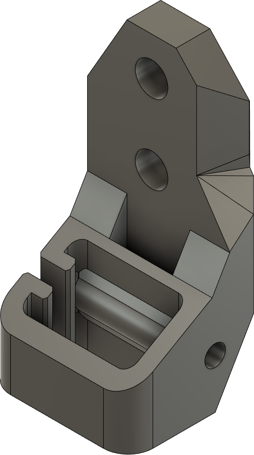
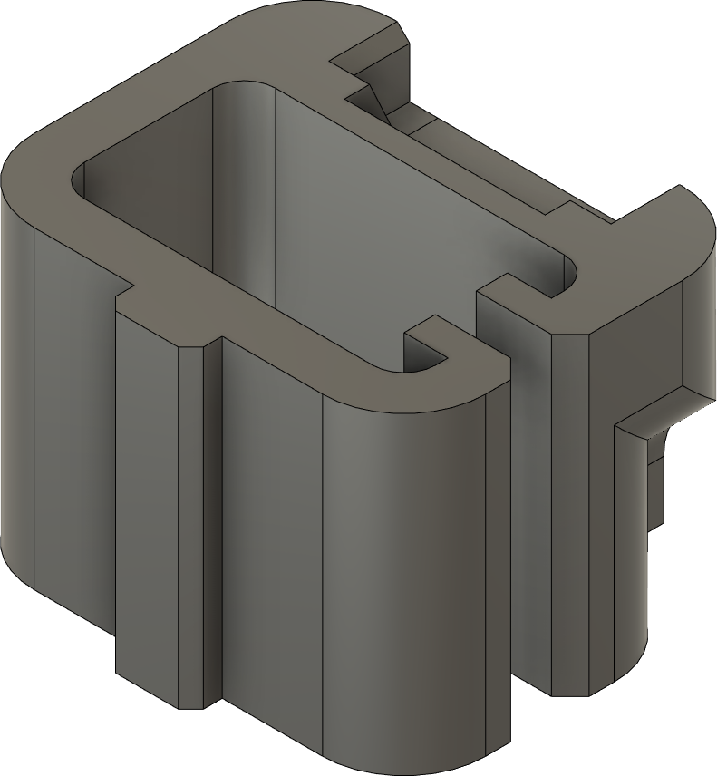

# Voron Belt chain

Three simple CADs recreated from STLs for the Voron V0 belt chain.

Belt chain mount recreated from STL in [christophmuellerorg/voron_0_kirigami_bed/STL](https://github.com/christophmuellerorg/voron_0_kirigami_bed/tree/master/STL)

Belt links recreated from STLs in [VoronUsers/printer_mods/Iakabos/V0_beltchain](https://github.com/VoronDesign/VoronUsers/tree/master/printer_mods/Iakabos/V0_beltchain)

