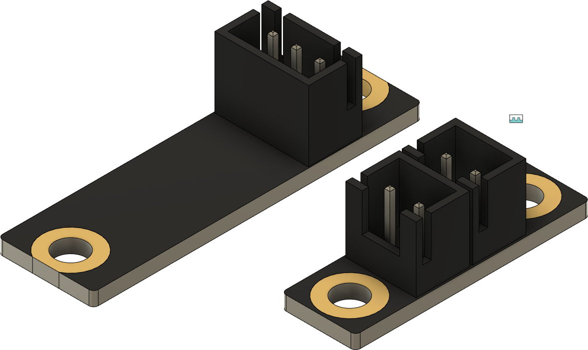

# ldo_kirigami_pcbs

A Two simple parts to imitate the PCBs that are part of the LDO Kirigami kit. 

[MotorDynamicsLab/LDOVoron0](https://github.com/MotorDynamicsLab/LDOVoron0/tree/v02/STLs/Kirigami)

